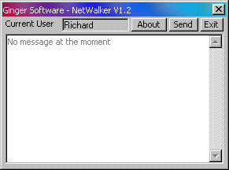



## Ginger Software Netwalker 1

### Description

It's abit like winpopup!
 
### More Info
 
You cant use it properly under win2k

You cant run win popup at the same time!

             |
---                |---
**Submitted On**   |2000-05-21 22:34:20
**By**             |[Richard Croxford](https://github.com/Planet-Source-Code/PSCIndex/blob/master/ByAuthor/richard-croxford.md)
**Level**          |Intermediate
**User Rating**    |3.7 (22 globes from 6 users)
**Compatibility**  |VB 3\.0, VB 4\.0 \(16\-bit\), VB 4\.0 \(32\-bit\), VB 5\.0, VB 6\.0, VB Script, ASP \(Active Server Pages\) 
**Category**       |[Complete Applications](https://github.com/Planet-Source-Code/PSCIndex/blob/master/ByCategory/complete-applications__1-27.md)
**World**          |[Visual Basic](https://github.com/Planet-Source-Code/PSCIndex/blob/master/ByWorld/visual-basic.md)
**Archive File**   |[CODE\_UPLOAD7491762000\.zip](https://github.com/Planet-Source-Code/richard-croxford-ginger-software-netwalker-1__1-9561/archive/master.zip)

